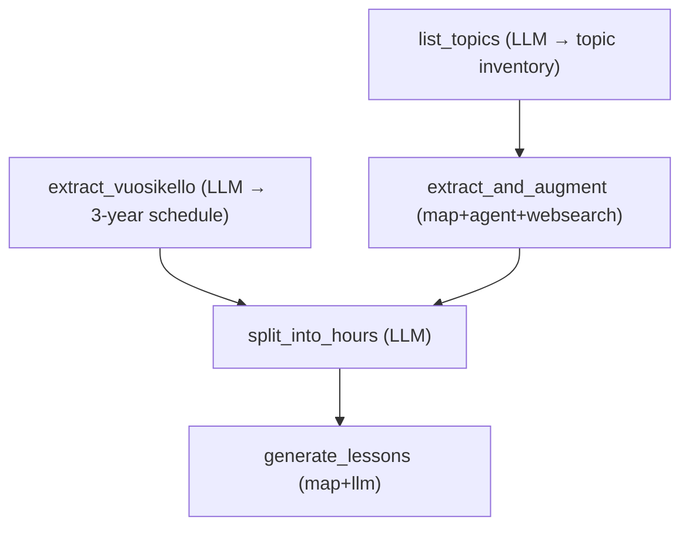

# Opinto-ohjaus Project Plan - Scoped to OP Courses

*Following the YAMLGraph Commandments: Research first, Plan with precision, Judge critically*

## Project Vision

**Goal**: Generate one-pager lesson plans covering the complete **opinto-ohjaus** (student counseling) curriculum in Finnish lukio — the OP courses specifically (OP1, OP2 + any optional modules), organized by the **ohjauksen vuosikello** (annual clock) across the full 3-year lukio period.

**Scope**: Opinto-ohjaus as a **taught subject** in lukio. Not the entire 150-point curriculum. Not a school management system. Just: research the OP course content → produce actionable lesson plans for the guidance counselor teaching those group sessions.

**Target User**: Lukion opinto-ohjaaja (guidance counselor) who teaches OP group sessions.

## Domain Context

### LOPS 2019 — Opinto-ohjaus Modules

**Mandatory modules (4 op total):**
- **OP1** (2 op): *Minä opiskelijana* — Lukioon kiinnittyminen, orientoituminen, itsetuntemus, opiskelutaidot, HOPS
- **OP2** (2 op): *Jatko-opinnot, työelämä ja tulevaisuus* — Jatko-opiskelumahdollisuudet, hakuprosessit, urasuunnittelu, korkeakouluyhteistyö

**Optional/local modules** (vary by school):
- **OP3+**: Paikallisia valinnaisia opintojaksoja (esim. tuutorointi, syvennetty työelämäprojekti, kansainvälisyys)
- **TO**: Temaattiset opinnot — oppiainerajat ylittävät laaja-alaisen osaamisen projektit

**Contact hours (arvio):**
- 1 op = 27h kokonaistyömäärä (kontaktiopetus + itsenäinen työ)
- Kontaktitunnit ~40-50% → **OP1: ~22-27 kontaktituntia, OP2: ~22-27 kontaktituntia**
- Tuntikesto vaihtelee: 45 min tai 75 min (konfiguroitava)

### Core Content Areas (from Research + LOPS 2019)

**OP1 — Minä opiskelijana (1. vuosi: Juniorivaihe):**
- Lukio-opintojen käytänteet, rakenne ja tavoitteet¹³
- Ryhmäytyminen ja lukioyhteisöön kiinnittyminen¹⁴
- Opiskelutaitojen kehittäminen ja itseohjautuvuus¹³
- Itsetuntemus, vahvuudet ja kiinnostuksen kohteet¹⁶
- HOPSin, yo-suunnitelman ja urasuunnitelman laatiminen¹³
- Digitaalisten oppimisympäristöjen hallinta¹³
- Hyvinvointi, jaksaminen ja stressinhallinta (todistusvalintapaine)⁴⁶
- Oppimisen tuki ja erityinen tuki — uudistus 1.8.2025⁴³
- Kurssivalinnat ja opintojen suunnittelu⁴⁹
- Oppimisvaikeuksien tunnistaminen (esim. lukitestit)²³

**OP2 — Jatko-opinnot, työelämä ja tulevaisuus (2.–3. vuosi):**
- Jatko-opintomahdollisuudet: yliopisto, AMK, kansainväliset polut¹³
- Yhteishaku, todistusvalinta ja valintakokeet — pisteytys ja strategia⁴
- Korkeakouluyhteistyö: korkeakoulukurkistukset, OAMK Highway, Opopassi⁴ ³⁷ ⁴¹
- Ylioppilastutkinto: koeaineiden valinta, vaikutus jatkohakuihin⁴
- Työelämätuntemus: muuttuvat osaamisvaatimukset, yrittäjyys, TET⁴
- Urasuunnittelu ja omien arvojen peilaaminen⁴
- Kansainväliset mahdollisuudet: vaihto-opiskelu, ulkomaiset korkeakoulut⁸
- Resilienssi ja muutosvalmius — kestävyysosaaminen⁵
- Välivuoden suunnittelu ja jälkiohjaus (valmistumisvuosi + 1v)⁴

### Ohjauksen vuosikello — lesson plan organizer

Tunnit eivät ole irrallisia, vaan ne noudattavat **lukiovuoden jatkumoa**:

| Vuosi | Syyslukukausi | Kevätlukukausi | Moduuli |
|---|---|---|---|
| **1. vuosi** | Ryhmäytyminen, lukioon sopeutuminen, HOPS | Ainevalinnat, yo-pohdinta, opiskelutaidot | OP1 |
| **2. vuosi** | Yo-suunnitelman tarkistus, korkeakoulutieto | Työelämätapahtumat, alakohtaiset haut | OP2 (alku) |
| **3. vuosi** | Yo-kokeet, jatko-opintohakujen valmistelu | Yhteishaku, valmistuminen, tulevaisuus | OP2 (loppu) |

### Session Types (työtavat)

Jokainen tunti on tyypeiltään yksi tai useampi näistä:

| Tyyppi | Kuvaus | Esimerkki |
|---|---|---|
| **Luokkaopetus** | Koko ryhmän info/opetus | Yo-tutkinnon rakenne |
| **Työpaja** | Hands-on: opiskelijat tekevät (HOPS, suunnitelmat) | HOPSin laatiminen |
| **Pienryhmä** | Vertaiskeskustelu, teemoittainen pohdinta | Urapohdinta pienryhmässä |
| **Vierailu/vierailija** | Kenttäkäynti tai asiantuntija luokassa | Korkeakoulukurkistus |
| **Verkko-ohjaus** | Digitaalinen itsenäinen tai ohjattu työ | Opintopolku.fi -tutustuminen |

### Assessment Model

OP-moduulit arvioidaan **suoritusmerkinnällä (S/H)**, ei numerolla. Arviointi perustuu:
- Aktiiviseen osallistumiseen
- HOPSin ja suunnitelmien laatimiseen/päivittämiseen
- Itsearviointiin ja portfoliotyöskentelyyn
- Ohjauskeskusteluihin osallistumiseen

### Laaja-alainen osaaminen (kaikki 6 aluetta)
1. **Hyvinvointiosaaminen** — Itsetuntemus, voimavarat, muutoskestävyys²⁷
2. **Vuorovaikutusosaaminen** — Sosiaaliset taidot, vertaisohjaus, pienryhmätyö⁹
3. **Monitieteinen ja luova osaaminen** — Oppiaineyhteydet urasuunnittelussa⁸
4. **Yhteiskunnallinen osaaminen** — Vastuullinen vaikuttaminen, työelämä¹⁷
5. **Eettisyys ja ympäristöosaaminen** — Kestävä tulevaisuus, valintojen seuraukset⁵
6. **Globaali- ja kulttuuriosaaminen** — Kansainvälisyys, vaihto-opiskelu⁸

### Koko koulu ohjaa — yhteistyötahot per tunti

Lesson plans should tag relevant collaboration partners:
- **Ryhmänohjaaja**: Ryhmäytyminen, opintojen seuranta, poissaolot
- **Aineenopettaja**: Aineen merkitys jatko-opinnoissa, opiskelutaidot
- **Erityisopettaja**: Oppimisen tuki, lukitestit, erityisjärjestelyt
- **Opiskeluhuolto**: Hyvinvointi, jaksaminen, kriisitilanteet
- **Rehtori**: Resursointi, ohjaussuunnitelma

## Phased Graph Architecture

### Architecture Decision: Map + Agent (FR-036 implemented in v0.4.40)

**Resolved**: `type: agent` is now supported as a map sub-node (v0.4.40, 2026-02-15).
The original constraint (map only supports `llm`, `python`, `tool_call`, `router`) has been lifted for `agent`.

**Architecture**:
- `extract_and_augment`: **map + agent** sub-node with `websearch` tool — parallel per-topic extraction + augmentation
- `generate_lessons`: **map + llm** sub-node — parallel one-pager generation (single LLM call sufficient)

```yaml
extract_and_augment:
  type: map
  over: "{state.topic_inventory}"
  as: topic
  node:
    type: agent
    tools: [websearch]
    prompt: extract-and-augment-topic
    state_key: augmented
    max_iterations: 3
  collect: augmented_topics
  on_error: skip
  max_items: 30
```

**Why agent, not subgraph**: Agent handles the web search → analyze → compile loop internally via tool-calling iterations. No need for a separate subgraph YAML. Simpler state flow, no input/output mapping.

### Process Design: Research-Doc-Driven (not LLM-Invented)

The research document (`lukion-opinto-ohjaus-opetussuunnitelma-ja-sisallot.md`, 299 lines, 51 sources) is the **source of truth** — not the LLM's training data. The LLM's job is to **extract, structure, augment, and synthesize** from this document, not to invent curriculum content from scratch.

**Key principle**: Every topic and schedule position must be traceable to the research doc. The LLM reads and extracts what's already there.

### Overview
```
Phase 1: List topics from research doc (LLM classification → lightweight inventory)
Phase 2: Extract vuosikello from research doc (LLM reads → structures)
Phase 3: Extract + augment per topic (map + agent: read research doc section + websearch)
Phase 4: Split into hours, cross-check against vuosikello (LLM)
Phase 5: Generate lesson one-pagers (map + llm)
```



Note: `list_topics` and `extract_vuosikello` are independent — they can run in parallel (topological parallelism via shared START predecessor).

**Design rationale**: Listing topics (classification) and extracting topic content (detailed reading) are separated. Listing is cheap and produces a **reviewable checkpoint** — the topic inventory can be inspected before committing to 15-25 agent calls. Extraction is then merged with augmentation into a single map+agent pass: each agent reads the research doc for its topic's details AND web searches for current information, producing one rich document per topic in a single loop.

### Graph 1: `opinto-ohjaus-pipeline.yaml` (Main Orchestrator)

**Input Variables:**
- `module`: "OP1" | "OP2" | "all"
- `school_context`: optional local customization (e.g., "ilmastolukio, OAMK Highway")
- `hours_per_module`: contact hours available (default: ~22-27)
- `lesson_duration`: 45 | 75 (minutes per lesson)

**Node Flow:**

#### Level 1 — List Topics + Extract Vuosikello (parallel)

**Node: `list_topics`** (LLM)
- Input: full research doc as prompt context
- Task: read the research doc and **identify** all distinct topics — classification, not detailed extraction
- Output: lightweight topic inventory of 15-25 items
- Each topic: `{id, title, one_line_description, module, research_doc_sections[]}`
  - `research_doc_sections` tells the downstream agent which parts of the research doc to focus on
- The LLM does NOT invent topics — it identifies what the research doc already describes
- **Checkpoint**: output is small and reviewable before committing to 15-25 agent calls
- **Deliverable**: `topic_inventory` — lightweight topic list extracted from research

**Node: `extract_vuosikello`** (LLM)
- Input: full research doc as prompt context
- Task: read the research doc and extract the 3-year × 2-semester schedule as structured data
- Output: the ohjauksen vuosikello as a structured list of time slots with content focus per period
- Each slot: `{year, semester, module, focus_areas[], key_activities[]}`
- The LLM does NOT invent the schedule — it reads the vuosikello table and surrounding text from the research doc
- **Deliverable**: `vuosikello` — structured 3-year schedule extracted from research

#### Level 2 — Extract + Augment per Topic

**Node: `extract_and_augment`** (Map node — `agent` sub-node with `websearch`)
- **Pattern**: `map` with `agent` sub-node per topic (FR-036, v0.4.40)
- Input: `topic_inventory` from `list_topics` + full `research_doc` as agent context
- Per-topic: agent loop that does **both** extraction and augmentation in one pass:
  1. **Extract**: reads the research doc sections relevant to this topic, produces a structured summary with source references, laaja-alainen tagging, and collaboration partners
  2. **Augment**: web searches for current/updated information (yhteishaku 2026, todistusvalinta changes, oppimisen tuki 1.8.2025 etc.)
  3. **Synthesize**: merges research-doc content with web search findings into one rich topic document
- Prioritizes Finnish sources: oph.fi, opintopolku.fi, eperusteet.opintopolku.fi
- Each topic gets **dedicated attention** — full context window, not competing with 24 other topics
- `max_iterations: 3` per topic (extract → search → synthesize)
- `on_error: skip` — topic falls back to research-doc-only extraction if web search fails
- `max_items: 30` safety cap
- **Deliverable**: `augmented_topics` — rich per-topic docs with research grounding + current info, collected via map reducer

#### Level 3 — Split into Hours + Cross-Check with Vuosikello

**Node: `split_into_hours`** (LLM)
- Input: `augmented_topics` + `vuosikello` + `hours_per_module` + `lesson_duration`
- Task: map augmented topics to concrete lesson slots, **cross-checking against vuosikello**
  - Each topic is assigned to a vuosikello time slot (year + semester)
  - Vuosikello acts as a **constraint**: topics must land in the right period
  - Session type (työtapa) assigned per lesson with variety enforcement
  - Progression and prerequisites considered within each semester
- Output: sequenced lesson mapping with vuosikello position, session type, laaja-alainen, collaboration tags
- **Deliverable**: `lesson_mapping` — cross-checked lesson sequence

#### Level 4 — Generate Lesson Plans

**Node: `generate_lessons`** (Map node — `llm` sub-node)
- **Pattern**: `map` with single `llm` sub-node per lesson
- Input: lesson mapping list from `split_into_hours` + augmented topic docs
- Per-lesson: single LLM call that produces a one-pager using the standardized template
  - Variables: lesson mapping entry (topic, vuosikello position, session type, laaja-alainen, collaboration)
  - Augmented topic doc injected as context — grounded in research + current sources
- `on_error: skip` for graceful degradation
- `max_items: 50` safety cap (covers both OP1 + OP2 at 45-min lessons)
- **Deliverable**: `lesson_plans` — one-pager per session collected via map reducer

## One-Pager Lesson Plan Template

```
┌──────────────────────────────────────────────────┐
│ OPINTO-OHJAUS — [OP1/OP2]                        │
│ Tunti [N]/[Total] — [Aihe]                       │
│ Vuosikello: [1. vuosi syksy / 2. vuosi kevät...] │
│ Tyyppi: [luokkaopetus|työpaja|pienryhmä|vierailu] │
├──────────────────────────────────────────────────┤
│ Tavoitteet (LOPS 2019)                           │
│ • [Learning objective 1]                         │
│ • [Learning objective 2]                         │
│                                                  │
│ Laaja-alainen osaaminen                          │
│ • [1-2 of: hyvinvointi, vuorovaikutus,           │
│    monitieteinen, yhteiskunnallinen,             │
│    eettisyys, globaali]                          │
├──────────────────────────────────────────────────┤
│ Tunnin kulku ([45/75] min)                       │
│ 1. Virittäytyminen (5-10 min) — [Activity]       │
│ 2. Työskentely (25-50 min) — [Main activity]     │
│ 3. Yhteenveto/reflektio (10-15 min) — [Wrap-up]  │
│                                                  │
│ Menetelmät                                       │
│ • [ryhmätyö, keskustelu, itsenäinen pohdinta,    │
│    vierailija, digitaalinen työkalu...]           │
├──────────────────────────────────────────────────┤
│ Materiaalit & Lähteet                            │
│ • [Links, resources, handouts]                   │
│                                                  │
│ Arviointi (suoritusmerkintä S/H)                 │
│ • [Osallistuminen, itsearviointi, portfolio,     │
│    HOPS-päivitys, reflektiokirjoitus]             │
│                                                  │
│ Eriyttäminen                                     │
│ • [Oppimisen tuki, erityisjärjestelyt]           │
│                                                  │
│ Koko koulu ohjaa — yhteistyö                     │
│ • [Ryhmänohjaaja / Aineenopettaja /              │
│    Erityisopettaja / Opiskeluhuolto]             │
└──────────────────────────────────────────────────┘
```

## Expected Outputs

| Deliverable | Format | Count |
|---|---|---|
| Topic inventory (from research) | Structured YAML/JSON | 15-25 lightweight items |
| Extracted vuosikello (from research) | Structured YAML/JSON | 1 (3 years × 2 semesters) |
| Augmented topic docs (extract + web search) | Markdown with links | 15-25 rich docs |
| Vuosikello-cross-checked lesson sequence | Markdown table | 1 |
| Lesson plan one-pagers | Markdown | ~20-24 per module (~40-48 total) |

**Note**: Lesson count depends on `lesson_duration` (45 or 75 min) and `hours_per_module`.
With 75-min lessons: ~18-20 per module. With 45-min lessons: ~24-27 per module.

## Technical Implementation

### YAMLGraph Patterns Used
- **Map + agent**: Per-topic extraction + augmentation with web search (Level 2) — FR-036, v0.4.40
- **Map + llm**: Parallel lesson generation (Level 4)
- **Topological parallelism**: `list_topics` and `extract_vuosikello` run in parallel (shared START predecessor)
- **Reviewable checkpoint**: `list_topics` output is lightweight and inspectable before committing to agent map
- **Structured output**: Pydantic schemas for topic inventory, vuosikello, lesson plans
- **Web search**: DuckDuckGo via `websearch` tool in agent sub-nodes
- **on_error: skip**: Graceful degradation if individual map items fail
- **max_items**: Safety cap on map fan-out (30 for extract+augment, 50 for lessons)

### Prompts Needed
```
prompts/
├── list-topics.yaml                # LLM reads research doc → lightweight topic inventory
├── extract-vuosikello.yaml         # LLM reads research doc → 3-year schedule
├── extract-and-augment-topic.yaml  # Agent: extract from research doc + web search (map sub-node)
├── split-into-hours.yaml           # Cross-check topics against vuosikello → lesson sequence
└── generate-lesson-plan.yaml       # One-pager (map sub-node prompt) with
                                    # vuosikello, työtapa, laaja-alainen,
                                    # osaaminen, collaboration
```

### State Schema
```yaml
state:
  module: str                        # OP1, OP2, or all
  school_context: str                # Local customization (e.g., "ilmastolukio")
  hours_per_module: int              # Contact hours available (~22-27)
  lesson_duration: int               # 45 or 75 minutes
  research_doc: str                  # Full research doc text (injected as input)
  topic_inventory: list[dict]        # Lightweight topic list from list_topics:
                                     #   {id, title, one_line_description, module, research_doc_sections[]}
                                     #   Reviewable checkpoint before agent map
  vuosikello: list[dict]             # Extracted 3-year schedule from research
  augmented_topics: list[dict]       # Rich per-topic docs (research extraction + web search)
  lesson_mapping: list[dict]         # Topic-to-session mapping cross-checked with vuosikello:
                                     #   vuosikello_slot: {year, semester}
                                     #   session_type: luokkaopetus|työpaja|pienryhmä|vierailu|verkko
                                     #   collaboration: [ryhmänohjaaja, erityisopettaja...]
                                     #   laaja_alainen: [hyvinvointi, vuorovaikutus...]
  lesson_plans: list[str]            # Generated one-pagers
  errors: list[PipelineError]        # Error tracking
```

## Success Criteria

1. **Coverage**: All OP1 + OP2 content areas from LOPS 2019 represented
2. **Vuosikello alignment**: Lessons follow 3-year annual clock progression
3. **Actionability**: Counselor can use one-pager directly with < 15 min editing
4. **Sources**: Each topic backed by 3+ relevant Finnish-language sources
5. **Session variety**: Mix of työtavat (luokkaopetus, työpaja, pienryhmä, vierailu)
6. **Laaja-alainen osaaminen**: All 6 areas covered across lesson set
7. **Compliance**: Learning objectives traceable to official LOPS 2019 text
8. **Koko koulu ohjaa**: Collaboration points tagged where relevant

## Risks & Mitigations

| Risk | Mitigation |
|---|---|
| Web search returns low-quality Finnish sources | Prioritize opintopolku.fi, oph.fi, eperusteet.opintopolku.fi in prompt |
| LOPS 2019 text not freely accessible online | Embed key OP specs as prompt context (research doc has full content) |
| Too many/few lessons for available hours | `hours_per_module` + `lesson_duration` configurable |
| Local curriculum variations | `school_context` variable (e.g., ilmastolukio, OAMK Highway) |
| Research results are generic | Finnish-specific search terms in prompt; web search for current sources |
| Todistusvalinta info changes annually | Flag time-sensitive content in lesson plans |
| Session type imbalance (too many lectures) | Enforce työtapa variety constraint in mapping node |
| 1.8.2025 oppimisen tuki reform | Embed reform details in OP1 prompt context |

## Implementation Sequence

### Step 1: Project scaffolding
- Create `projects/opinto_ohjaus/` directory structure (graphs/, prompts/)
- Prepare research doc as injectable prompt context
- Create main graph YAML with edges (list_topics + extract_vuosikello from START)

### Step 2: Level 1 — List Topics + Extract Vuosikello
- Implement `list-topics.yaml` prompt — LLM reads research doc, outputs lightweight inventory
- Implement `extract-vuosikello.yaml` prompt — LLM reads research doc, outputs structured schedule
- Test both independently; validate outputs against research doc content
- Verify topological parallelism (both run from START)
- **Review checkpoint**: inspect topic inventory before proceeding

### Step 3: Level 2 — Extract + Augment (map+agent)
- Implement `extract_and_augment` map node with `agent` sub-node and `websearch` tool
- Craft `extract-and-augment-topic.yaml` prompt: extract section from research doc + web search
- Test with 3-5 topics, verify agent does both extraction and web search in one loop
- Verify `on_error: skip` (topic falls back to research-doc-only extraction)
- Validate: augmented docs have real source references and current URLs

### Step 4: Level 3-4 — Hours + Lessons
- Implement `split_into_hours` — cross-check augmented topics against vuosikello
- Implement `generate_lessons` map node with `llm` sub-node
- Test with OP1; validate vuosikello alignment and työtapa variety

### Step 5: Full Pipeline
- Run OP1 + OP2 end-to-end
- Review all ~40-48 lesson plans
- Verify: every topic traceable to research doc, every lesson in correct vuosikello slot
- Verify: all 6 laaja-alaisen osaamisen areas represented
- Iterate on prompt quality based on output review

---

## Research-Plan Alignment Log

*Corrections applied after comparing plan against external research (lukion-opinto-ohjaus-opetussuunnitelma-ja-sisallot.md):*

| Finding | Plan Impact |
|---|---|
| Ohjaus follows 3-year vuosikello | Added vuosikello as organizing structure |
| 4 työtavat + verkko-ohjaus identified | Added session type classification |
| 1 op ≠ 27h contact; it's total student work | Fixed hours estimate, added lesson_duration var |
| Todistusvalinta pressure is major theme | Added to OP1 (hyvinvointi) and OP2 (hakustrategia) |
| OAMK Highway, Opopassi are concrete mechanisms | Added to OP2 content areas |
| Oppimisen tuki reform 1.8.2025 | Added to OP1 content, risk matrix |
| Assessment is suoritusmerkintä (S/H) | Updated template, added assessment model section |
| Laaja-alainen osaaminen: 6 areas with exact names | Listed all 6 with Finnish names and references |
| "Koko koulu ohjaa" collaboration model | Added collaboration tagging to template |
| LOPS 2019 (not 2021) is the correct reference | Fixed throughout |

---

*Scoped. Focused. Vuosikello-organized. One subject, one pipeline, real deliverables for one guidance counselor.*

---

## Architecture Amendment Log

*Corrections applied after Judgement review and map node investigation:*

| Issue | Severity | Resolution |
|---|---|---|
| Plan used map+subgraph — not supported | FATAL | Flattened to map+llm sub-nodes. Single rich prompt per topic/lesson replaces multi-step subgraphs |
| Plan used map+agent/websearch — not supported | FATAL | ~~Dropped web search from map loop~~ **RESOLVED**: FR-036 implemented in v0.4.40. `type: agent` now supported as map sub-node. Web search restored. |
| `generate_search_terms` node — no longer needed | Removed | Search terms were for web search; dropped with subgraph |
| `topic-research.yaml` subgraph — not supported in map | Removed | Replaced by `research-topic.yaml` prompt (single LLM call) |
| `lesson-generator.yaml` subgraph — overkill for single LLM call | Removed | Replaced by `generate-lesson-plan.yaml` prompt (direct map sub-node) |
| `synthesize_research` phantom node in mermaid | Removed | Was in diagram but not in node descriptions |
| `build-vuosikello.yaml` prompt — no corresponding node | Removed | Vuosikello mapping folded into `map-topics-to-hours.yaml` |
| LOPS 2021 reference in Level 1 | Fixed | Changed to LOPS 2019 |
| Prompt list had 8 prompts for 7+subgraph nodes | Fixed | Reduced to 5 prompts matching 5 nodes |
| `search_terms` state key — no longer needed | Removed | Simplified state schema |

**Reference**: `projects/innovators_toolkit/plan.md` — documented the same map+subgraph limitation and its topological parallelism workaround. Opinto-ohjaus uses the simpler map+llm pattern instead because all items undergo the same operation (unlike toolkit's heterogeneous tools).

### Process Restructuring: Top-Down → Research-Driven (Amendment 3)

| Change | Rationale |
|---|---|
| `analyze_curriculum` → `extract_topics` (LLM reads research doc) | Research doc already contains full LOPS 2019 OP specs. LLM extracts and structures rather than inventing from training data. |
| New: `extract_vuosikello` (LLM reads research doc) | Vuosikello is explicitly in research doc (lines 165-185). Extract as structured data for cross-checking, not as LLM invention. |
| `extract_topics` (old) merged into new `extract_topics` | Old node invented topics; new node extracts them from research text. |
| `research_topics` → `augment_topics` | Renamed to reflect that web search augments extracted content, not researches from scratch. |
| `map_to_hours` → `split_into_hours` | Now explicitly cross-checks against extracted vuosikello. Not just mapping — validating against a constraint. |
| New state keys: `research_doc`, `vuosikello`, `augmented_topics` | Research doc is explicit input; vuosikello is first-class structured data; augmented_topics distinct from raw extracted topics. |
| Topological parallelism for extract nodes | `extract_topics` and `extract_vuosikello` are independent — can run in parallel from START. |
| All extraction nodes are LLM (not python/regex) | LLM is better at reading natural language documents and producing structured output. No brittle regex parsing. |
| **Key principle**: Research doc is source of truth | Every topic and vuosikello position must be traceable to the research doc. Web search augments; it does not replace. |

### Listing vs. Extraction Separation (Amendment 4)

| Change | Rationale |
|---|---|
| `extract_topics` split into `list_topics` (LLM) + extraction in `extract_and_augment` (map+agent) | Listing (classification) and extraction (detailed reading) are different cognitive tasks. Listing is cheap and produces a reviewable checkpoint. |
| `augment_topics` merged into `extract_and_augment` | Once listing is separated, per-topic extraction and per-topic augmentation become the same agent loop: read research doc section + web search + synthesize. One map pass instead of two. |
| New state key: `topic_inventory` (lightweight) replaces `topics` (heavy) | Inventory is `{id, title, one_line_description, module, research_doc_sections[]}` — small, reviewable, serves as fan-out for the map node. |
| **Key insight**: splitting list from extract creates the opportunity to merge extract with augment | Each agent gets dedicated attention per topic — full context window, not competing with 24 other topics in one LLM call. |